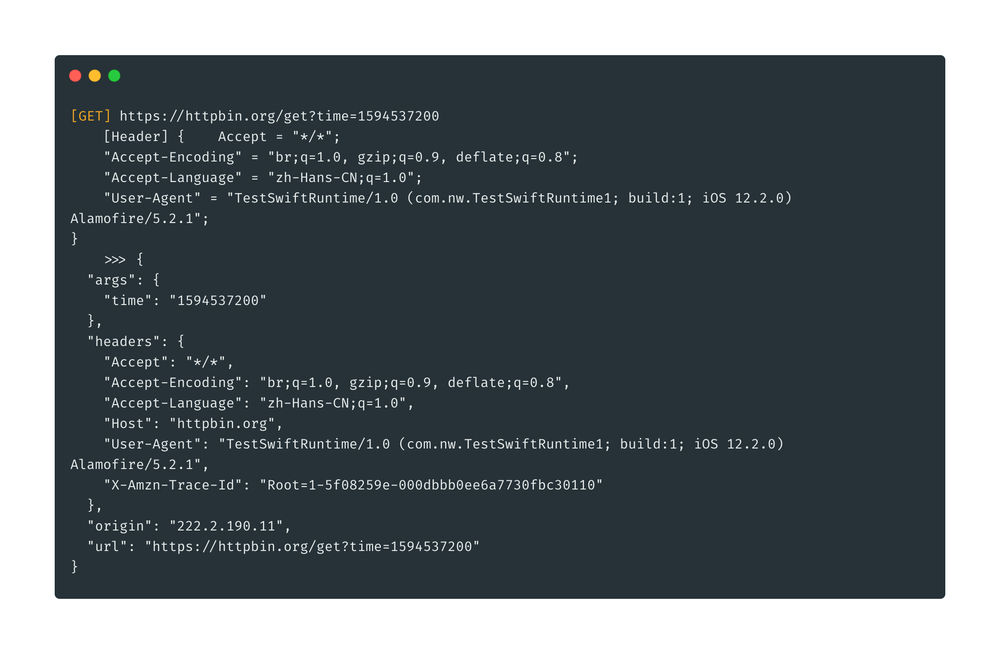

### FridaHookSwiftAlamofire

A frida tool that capture GET/POST HTTP requests of iOS Swift library 'Alamofire' and disable SSL Pinning. 

### Features

* Capture and print GET/POST HTTP requests in Alamofire
* Kill SSL Pinning in Alamofire
* Swift runtime interop in Frida (Support Swift Foundation URL/Data/String)
* Support Swift 5.*
* Demo code for calling swift runtime function `Foundation.Data._bridgeToObjectiveC()`

#### Usage

1. build frida-agent (npm install && npm run watch)
2. ./run.sh or frida -UF -l ./frida-agent/_agent.js

#### License

MIT

