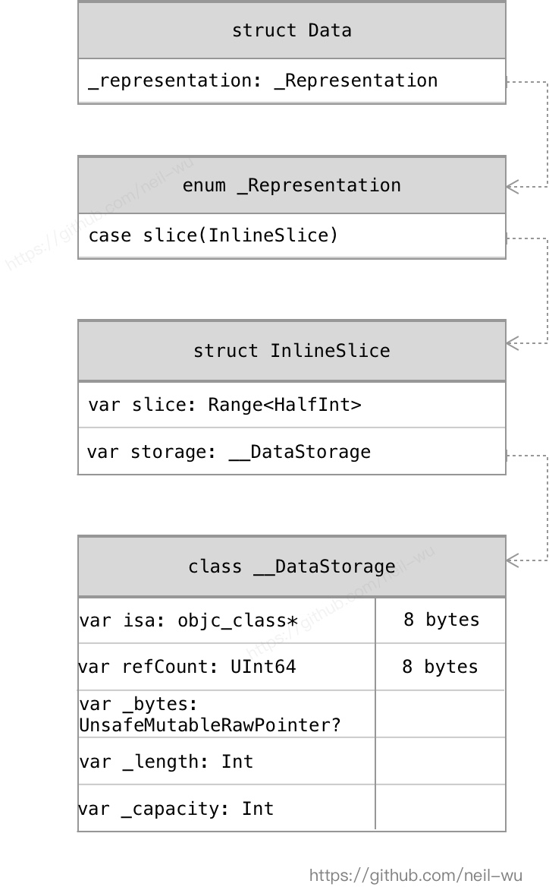
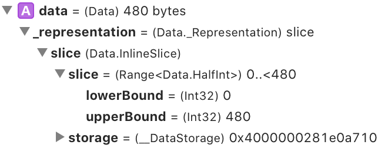

初探Swift Runtime：使用Frida实现针对Alamofire的抓包工具

### 0x00 背景
Swift自2014年发布以来，在Apple的开发生态下占据的位置越来越重要，国外友人在2019年统计过超过半数的非游戏类app已经使用swift，淘宝技术团队曾发文介绍过他们的[swift实践](https://mp.weixin.qq.com/s/UfOJK07Lhw72dGf0z1znbA)。随着swift5在2019年的发布，swift也终于进入ABI稳定，这无疑具有里程碑的意义，相信会有更多的App将离不开swift。

从逆向的角度看，关于swift的研究分析却较少，一些好项目还由于面向的swift的版本过老而与swift5存在兼容问题无法使用，比如 [swift-frida](https://github.com/maltek/swift-frida)。

笔者最近粗略学习了一下swift相关的文档，从swift类型在Mach-O文件中的结构入门，逐步到运行时分析。已经实现了一个从Mach-O文件中获取swift对象定义的命令行工具[SwiftDump](https://github.com/neil-wu/SwiftDump)，包括其Frida版本[FridaSwiftDump](https://github.com/neil-wu/FridaSwiftDump/)。

在本文中，将着重从Swift Runtime数据结构入手进行分析，面向Github上3.3万star的swift HTTP网络库[Alamofire](https://github.com/Alamofire/Alamofire)，实现一个基础版本的抓包工具，具备：打印GET/POST请求；屏蔽SSL Pinning。过程中会介绍到swift的内存布局，函数调用约定，参数传递，运行时函数调用。

**项目地址：[FridaHookSwiftAlamofire](https://github.com/neil-wu/FridaHookSwiftAlamofire)**

### 0x01 测试环境
新建空的iOS Swift工程，并使用cocoapods 引用 Alamofire 5.2.1作为framework。
使用的Xcode版本为Version 11.5 (11E608c)，swift 5.2，在ARM64的真机下运行。

### 0x02 确认关键函数

我们先从正向的开发环境入手，搞清楚Alamofire的请求过程，挖掘出合适的函数进行Hook。使用Frida完成一个可用的版本后，对其他app进行测试查看实际的使用效果。

#### 1. Alamofire Get请求示例

发送一个简单的GET请求，测试代码如下：
``` Swift
import Alamofire

let urlstr = "https://httpbin.org/get?time=\( Int(Date().timeIntervalSince1970) )";
AF.request(urlstr).response { (rsp:AFDataResponse<Data?>) in
    if let data = rsp.data {
        let str = String(data: data, encoding: String.Encoding.utf8) ?? "nil"
        print("rspstr=", str);
    } else {
        let str: String = "faild, err=\(rsp.error?.errorDescription ?? "nil")"
        print(str);
    }
}
```

#### 2. Alamofire的实现分析

AF 是 Session.default，`Session` 是Alamofire中创建和管理`Request`。
调用 AF.request 后， Session会新建一个DataRequest, 并将其加入requestQueue中执行setup过程进行创建。
查看DataRequest，在新建出来后，会调用：
`override func task(for request: URLRequest, using session: URLSession) -> URLSessionTask`
熟悉OC的朋友都知道，OC里有个NSURLSessionTask，此处的URLSessionTask正是为了兼容OC而存在的，可以[查看其源码](https://github.com/apple/swift-corelibs-foundation/blob/master/Sources/FoundationNetworking/URLSession/URLSessionTask.swift)。

既然是与OC兼容，那我们就以Hook OC的方式Hook函数 `open func dataTask(with request: URLRequest, completionHandler: @escaping (Data?, URLResponse?, Error?) -> Void) -> URLSessionDataTask`。具体实现在 HookDataTaskWithRequest.ts 中，此处比较简单，不再赘述。

运行Frida Hook，重新发送GET请求，发现确实触发了该Hook，但是completionHandler参数为空。为什么呢？

继续回到Alamofire源码，看到 Session.swift 的init里可以看到默认URLSession的delegate为SessionDelegate，由其处理请求的各种数据和状态回调。

找到`open func urlSession(_ session: URLSession, dataTask: URLSessionDataTask, didReceive data: Data)`，在此函数内接收回包的数据。我们在此进行Hook。这是一个swift函数，并不能用刚才OC的方法进行hook。swift导出的函数在被编译的时候，函数符号名会被name mangle，在swift5下，变为以$开始的一个字符串，其中包含类型信息，比如该函数被修饰为：
`$s9Alamofire15SessionDelegateC03urlB0_8dataTask10didReceiveySo12NSURLSessionC_So0i4DataF0C10Foundation0J0VtF` 

我们可以用以下命令来将符号还原（注意$符号前面的\）：

`swift demangle "\$s9Alamofire15SessionDelegateC03urlB0_8dataTask10didReceiveySo12NSURLSessionC_So0i4DataF0C10Foundation0J0VtF"` 
输出结果为 
`Alamofire.SessionDelegate.urlSession(_: __C.NSURLSession, dataTask: __C.NSURLSessionDataTask, didReceive: Foundation.Data) -> ()`
确认是我们需要的函数符号。


### 0x03. Foundation.Data的内存布局

接着以上步骤，在Frida中使用 getExportByName，来获取函数指针并Hook。第一个参数和第二个参数都是兼容OC的类型，可以转为Frida的ObjC.Object类型进行访问。第三个参数为Swift的Foundation.Data类型，怎么获取其数据呢？

先来研究Foundation.Data，Swift的Foundation库已经[开源](https://github.com/apple/swift-corelibs-foundation)，可以一探究竟。找到 `Data.swift`，将其简化一下，只保留相关定义：

```Swift
public struct Data : ReferenceConvertible, Equatable, Hashable, RandomAccessCollection, MutableCollection, RangeReplaceableCollection, MutableDataProtocol, ContiguousBytes {
    // A small inline buffer of bytes suitable for stack-allocation of small data.
    struct InlineData {// max=15 bytes
        var bytes: Buffer // 15 bytes
        var length: UInt8 // 1 bytes
    }
    // A buffer of bytes too large to fit in an InlineData, but still small enough to fit a storage pointer + range in two words.
    struct InlineSlice {  // max=HalfInt.max
        var slice: Range<HalfInt>
        var storage: __DataStorage
    }
    final class RangeReference {
    }
    // A buffer of bytes whose range is too large to fit in a signle word. Used alongside a RangeReference to make it fit into _Representation's two-word size.
    struct LargeSlice {
        var slice: RangeReference
        var storage: __DataStorage
    }
    
    // The actual storage for Data's various representations.
    internal enum _Representation {
        case empty
        case inline(InlineData)
        case slice(InlineSlice)
        case large(LargeSlice)
    }
    internal var _representation: _Representation
}
// Underlying storage representation for medium and large data.
internal final class __DataStorage {
    //
}
```

基本结构已知，根据的Data大小不同有不同的表示方式，具体参考上面代码的注释。在arm64环境下，我们的测试请求响应数据大小只有几百bytes，符合InlineSlice。结构如下图所示：


[Swift ABI调用约定](https://github.com/apple/swift/blob/master/docs/ABI/CallingConvention.rst#id13)里有介绍，swift非常注重第一类型，并且能够在寄存器中直接传递类型值。

在此处的Data类型就用到了这种方法。Data类型的数据被分为两个寄存器来传递：args[2]传递range信息，args[3]传递__DataStorage指针(args[0]指向NSURLSession，args[1]指向NSURLSessionDataTask，函数原型只有三个参数，但实际上调用时会有4个参数)。


```
args[2] = 0x1e000000000 => 0x0,0x1e0 => range from 0 to 0x1e0
args[3] = DataStorage's address
```

而__DataStorage是swift class，可以根据[class memory-layout](https://github.com/TannerJin/Swift-MemoryLayout/blob/master/Swift/Class.swift)，解析出对应的地址（参考上面的结构关系图，代码实现在 SDSwiftDataStorage.ts中）。

注：事实上，我们在正向开发过程中，用Xcode打断点调试，也能看到swift Data的大概结构，如下图：



### 0x04. Kill SSL Pinning

先看看Alamofire怎么使用SSL Pinning:

``` Swift
let manager = ServerTrustManager(evaluators: ["httpbin.org": PinnedCertificatesTrustEvaluator()])
self.session = Session(serverTrustManager: manager)
```

跟踪代码，在`func attemptServerTrustAuthentication(with challenge: URLAuthenticationChallenge) -> ChallengeEvaluation` 里会判断是否需要检查证书，设置了Pinning后会返回useCredential，如果没有设置任何检查项，则返回`(.performDefaultHandling, nil, nil)`，我们在此只需修改该函数永远返回这个Tuple值。
Tuple的memory layout是线性布局的(如果未内存对齐，会为了内存对齐填充0)，用Frida Hook后，指针指向的第一个值就是要修改的值。

代码在HookAFServerTrust.ts中，如下：
``` TypeScript
// TypeScript
let func_attemptServerTrust = Module.getExportByName(null, '$s9Alamofire15SessionDelegateC32attemptServerTrustAuthentication4withSo36NSURLSessionAuthChallengeDispositionV11disposition_So15NSURLCredentialCSg10credentialAA7AFErrorOSg5errortSo019NSURLAuthenticationK0C_tF'); 
log(`[HookAFServerTrust] hook func_attemptServerTrust ${func_attemptServerTrust}`);
Interceptor.attach(func_attemptServerTrust, {
    onLeave(retval:InvocationReturnValue) {
        // force set retval to 0x1 to enable .performDefaultHandling
        let val = retval.toInt32();
        if (val != 0x1) {
            log(`[HookAFServerTrust] attemptServerTrustAuthentication retval ${retval}, reset to 0x1`);
            let fakeret = new NativePointer(0x1)
            retval.replace(fakeret)
        }
    }
});
```


### 0x05. Swift String

如果我们想获取字符串Swift.String的值，该怎么做呢？
查看String的[内存布局](https://github.com/TannerJin/Swift-MemoryLayout/blob/master/SwiftCore/String.swift)。我们可知，String是Struct，值类型，分为 Small(<=15bytes) 和 Large两种表示方式。我们知道Foundation.URL有个函数可以根据String初始化。符号如下：
`s10Foundation3URLV6stringACSgSSh_tcfC ---> Foundation.URL.init(string: __shared Swift.String) -> Foundation.URL?`。hook这个函数，笔者发现，对于Small String，Swift会直接使用两个参数来传递该值。对于Large String，是使用两个参数分别指向了两个属性（符合ABI里介绍的调用约定，Swift值类型在传递时特定的情况下会直接用寄存器传递）。具体代码在文件SDSwiftString.ts中。


### 0x06. One More Step

能否直接调用Swift的运行时函数呢？
答案是可以的，但是需要传入合适的参数。
举个例子：
使用IDA分析我们的测试程序，可以发现`$s10Foundation4DataV19_bridgeToObjectiveCSo6NSDataCyF` 函数原型为
`Foundation.Data._bridgeToObjectiveC() -> __C.NSData` 
它可以将Data类型转为NSData类型，而NSData类型我们是可以直接在Frida下使用的OC类型。参考以上，可以将Data用两个参数传递给这个函数即可，分别表示range和DataStorage。示例代码在 `SwiftRuntime.ts`中：

``` TypeScript
// 获取函数符号地址
const func_data2nsdata_ptr = Module.getExportByName(null, '$s10Foundation4DataV19_bridgeToObjectiveCSo6NSDataCyF');
//生成函数指针用于调用
funcptr_data_bridgeToObjectiveC = new NativeFunction(func_data2nsdata_ptr,'pointer', ['pointer', 'pointer']);

//调用
let ret:NativePointer = funcptr_data_bridgeToObjectiveC(rangePtr, dataStoragePtr) as NativePointer;
let ocret = new ObjC.Object(ret); // is __NSSwiftData: NSData
// 接下来可以直接调用OC的函数了，比如： ocret.length() ， ocret.bytes()
```


### 0x07. 总结

Swift为了与OC兼容，保留了部分动态性，同时，为了更高效的运行，充分利用了寄存器，能直接传递就不间接传递，以实现的复杂性来得到运行的高效性。当然对于逆向研究来说，这里面还有很多可以挖掘的地方，笔者在此仅尝试了一小部分且仍有瑕疵，欢迎大家留言交流学习。


#### 参考资料

* [Swift ABI](https://github.com/apple/swift/blob/master/docs/ABI/CallingConvention.rst)
* [swift-corelibs-foundation](https://github.com/apple/swift-corelibs-foundation)
* [Swift-MemoryLayout](https://github.com/TannerJin/Swift-MemoryLayout)


